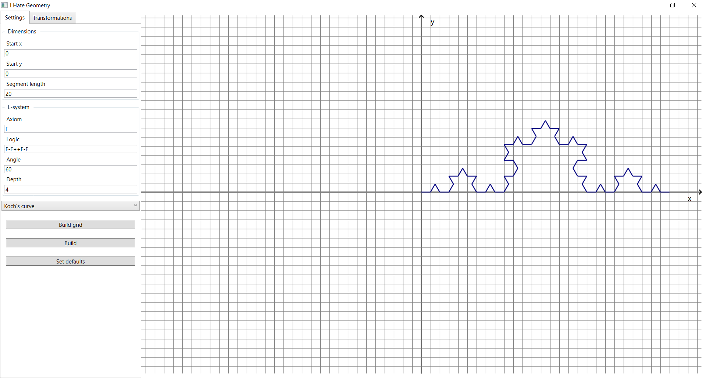
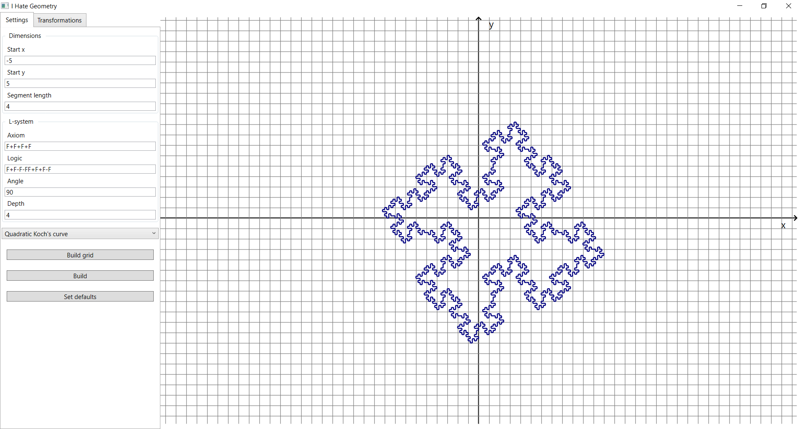
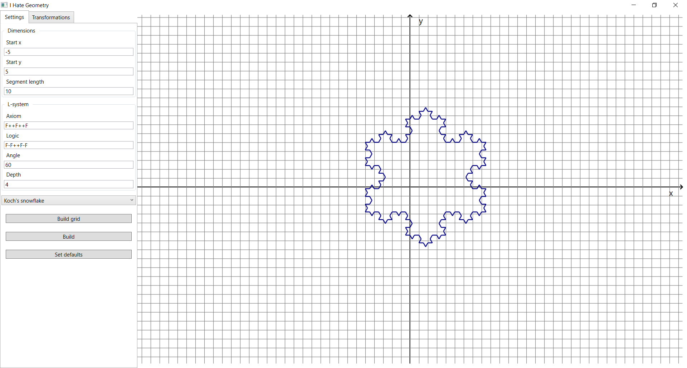

# KochFractal
The project is dedicated to drawing and transforming the [Koch fractal family](https://en.wikipedia.org/wiki/Koch_snowflake).

## Fractals
The user is allowed to change the rules and parameters for fractal build or choose one of available presets:
- Quadratic Koch's curve
- Koch's curve
- Koch's snowflake

## Transformations
Available transformations (with animations support):
- x and y offset
- Rotation around a point by a selected angle

The project is written on poor WPF and C#.

## Examples

Koch's curve

Quadratic Koch's curve

Koch's snowflake
